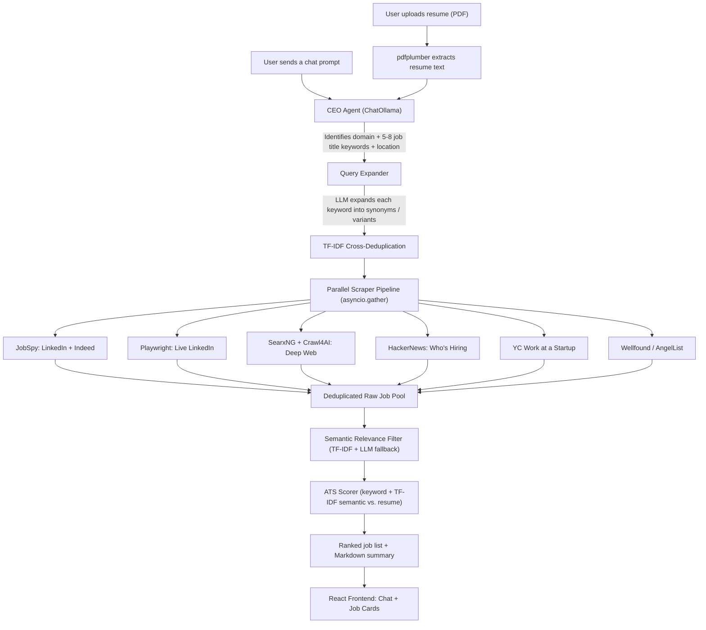

# 🎯 Job Hunt AI Agent

**An AI-powered, multi-source job search assistant that reads your resume, expands your search across the web, and ranks every result against your profile.**

Upload a resume, type a request like *"Find me remote LangChain internships"*, and the agent will: expand that request into a dozen related search queries, scrape six different job sources in parallel, filter out irrelevant noise using semantic similarity, score every remaining job against your resume (ATS-style + semantic match), and return a ranked, conversational summary with interactive job cards.


---

## ✨ Features

- **Resume-aware AI agent** — Upload a PDF resume; an LLM (via [Ollama](https://ollama.com)) reads it alongside your chat prompt to identify your domain, seniority, and 5–8 highly specific job titles to search for.
- **Semantic query expansion** — Each extracted job title is expanded by the LLM into synonyms, seniority variants, and adjacent roles, then cross-deduplicated with TF-IDF so near-identical queries aren't fired twice.
- **Six-source parallel aggregation pipeline** — Runs concurrently with `asyncio`:
  - **JobSpy** (LinkedIn & Indeed)
  - **Playwright** (live LinkedIn job search, bypassing API limits)
  - **SearxNG + Crawl4AI** (deep web search across job boards like Naukri, Internshala, Glassdoor, Wellfound, Monster, etc., with LLM-based extraction and login-wall detection)
  - **HackerNews "Who is Hiring?"** threads (LLM-parsed from raw comments)
  - **YC Work at a Startup**
  - **Wellfound / AngelList**
- **Two-stage relevance filtering** — A fast TF-IDF cosine-similarity pass removes obviously irrelevant jobs, with an LLM fallback for borderline cases.
- **ATS + Semantic resume scoring** — Every job gets an `ats_score` (keyword overlap with your resume), a `semantic_score` (TF-IDF cosine similarity), and a `combined_score`, so results are ranked by genuine fit, not just keyword presence.
- **Conversational UI** — A React + Tailwind CSS chat interface with Markdown rendering, filterable/sortable job cards, source chips, and score sliders.
- **MCP server export** — The same aggregation pipeline can be exposed as a [Model Context Protocol](https://modelcontextprotocol.io/) tool for use in Claude Desktop, Cursor, or other MCP clients.

---

## 🧠 How It Works



### Pipeline walkthrough

1. **Resume parsing** — `POST /api/upload_resume` extracts text from the uploaded PDF using `pdfplumber` and stores it for the session.
2. **Keyword extraction** (`agent.py`) — The user's chat message and resume text are sent to a local/cloud Ollama model, which identifies the candidate's primary domain (e.g. Generative AI, DevOps, Full Stack) and returns 5–8 specific, niche job title keywords plus a target location.
3. **Query expansion** (`query_expander.py`) — Each keyword is expanded by the LLM into up to 12 semantically related variants (synonyms, intern/seniority variants, adjacent roles), then the full set is cross-deduplicated using TF-IDF cosine similarity so highly similar queries aren't searched twice.
4. **Parallel scraping** (`pipeline.py`, `scraper.py`, `startup_scrapers.py`) — All six scrapers run concurrently via `asyncio.gather`, with synchronous scrapers (JobSpy, Playwright) offloaded to thread pools so they don't block the event loop.
5. **Deduplication** — Raw results are deduplicated by URL (or title+company fallback).
6. **Relevance filtering** (`relevance_filter.py`) — Each job is checked against the expanded query set using TF-IDF cosine similarity; borderline-scoring jobs get a second pass from the LLM to decide keep/discard.
7. **Enrichment** — Wellfound listings (which don't include a description on the search page) are lazily enriched with a full description if they survive filtering.
8. **ATS scoring** (`ats_scorer.py`) — Each job is scored against the resume on two independent axes:
   - **ATS score**: percentage of the resume's extracted skills that also appear in the job text.
   - **Semantic score**: TF-IDF cosine similarity between the resume and the job text.
   - **Combined score**: `0.5 × ATS + 0.5 × Semantic`.
9. **Response** — A Markdown summary (search stats, strong/good match counts) plus the full ranked job list are returned to the frontend, which renders the summary as chat and the jobs as interactive cards.

---

## 🏗️ Tech Stack

| Layer | Technologies |
|---|---|
| **Backend** | Python 3.11+, FastAPI, Uvicorn, CrewAI, LangChain + `langchain-ollama` (ChatOllama), Ollama (local or cloud-hosted models) |
| **Scraping** | JobSpy, Playwright, BeautifulSoup4, Crawl4AI, SearxNG (self-hosted), feedparser, httpx/requests |
| **NLP / Scoring** | scikit-learn (TF-IDF, cosine similarity), regex-based skill extraction |
| **Resume parsing** | pdfplumber |
| **Frontend** | React 19, TypeScript, Vite, Tailwind CSS v4, react-markdown, remark-gfm |
| **Interop** | Model Context Protocol (MCP) server export |
| **Infra** | Docker (for SearxNG) |

---

## 📁 Project Structure

```
job-hunt-agent/
├── backend/
│   ├── main.py               # FastAPI app — /api/chat, /api/upload_resume
│   ├── agent.py               # "CEO agent": resume + prompt -> keyword list + location
│   ├── pipeline.py             # Async orchestrator: expand -> scrape -> filter -> score
│   ├── query_expander.py       # LLM query expansion + TF-IDF cross-deduplication
│   ├── relevance_filter.py      # TF-IDF + LLM relevance filtering
│   ├── ats_scorer.py            # ATS keyword score + TF-IDF semantic score
│   ├── scraper.py                # JobSpy, Playwright/LinkedIn, HackerNews, RSS, SearxNG+Crawl4AI
│   ├── startup_scrapers.py        # HN "Who's Hiring" parser, YC Work at a Startup, Wellfound
│   ├── mcp_export.py               # MCP server exposing the aggregator as a tool
│   ├── crew_agency.py               # Earlier CrewAI-based orchestrator (superseded by pipeline.py)
│   ├── requirements.txt
│   └── test_*.py                     # Standalone scripts for testing individual scrapers/scorers
├── frontend/
│   ├── src/
│   │   ├── App.tsx            # Chat UI, filters, sorting, job list
│   │   ├── JobCard.tsx          # Individual job card with score badges
│   │   └── ...
│   ├── package.json
│   └── vite.config.ts
├── searxng_config/
│   ├── Dockerfile               # Builds a custom SearxNG image with bundled settings.yml
│   └── settings.yml               # SearxNG instance config (must enable the JSON API — see setup)
└── README.md
```

> **Note on `crew_agency.py`:** this file contains an earlier implementation of the aggregation pipeline built with CrewAI. It has been superseded by the lighter-weight, custom async orchestrator in `pipeline.py`, which is what `agent.py` actually calls. It's kept in the repo for reference.

---

## 🚀 Getting Started

### Prerequisites

- [Python 3.11+](https://www.python.org/downloads/)
- [Node.js 20+](https://nodejs.org/)
- [Git](https://git-scm.com/)
- [Docker](https://www.docker.com/) (for SearxNG)
- [Ollama](https://ollama.com/) — installed and running locally, with a model pulled (local or [cloud-hosted](https://ollama.com/cloud))

### 1. Clone the repository

```bash
git clone https://github.com/avish006/job-hunt-agent.git
cd job-hunt-agent
```

### 2. Backend setup

```bash
cd backend
python -m venv venv
```

Activate the virtual environment:

```bash
# Windows (PowerShell)
.\venv\Scripts\Activate.ps1

# macOS / Linux
source venv/bin/activate
```

Install dependencies and the Playwright browser:

```bash
pip install -r requirements.txt
playwright install chromium
```

**Windows only** — the MCP server uses COM objects via `pywin32`. Run the post-install script once so `pywintypes` resolves correctly:

```bash
python .\venv\Scripts\pywin32_postinstall.py -install
```

### 3. Set up SearxNG (used by the deep-web scraper)

The `SearxNGCrawl4aiScraper` queries a local SearxNG instance for candidate URLs (`http://localhost:8080/search?format=json`) before crawling them with Crawl4AI. Two things need to be configured for this to work:

**a) Enable the JSON API.** SearxNG ships with only the `html` output format enabled. Open `searxng_config/settings.yml` and find:

```yaml
search:
  formats:
    - html
```

Add `json`:

```yaml
search:
  formats:
    - html
    - json
```

**b) Build and run the container**, mapping the container's internal port `8888` to host port `8080` (this matches the URL the scraper queries):

```bash
cd ../searxng_config
docker build -t job-hunt-searxng .
docker run -d --name job-hunt-searxng -p 8080:8888 job-hunt-searxng
```

Verify it's running by visiting `http://localhost:8080` in your browser — you should see the SearxNG search page.

> If you skip this step, the SearxNG-based scraper will fail silently (it catches its own exceptions and returns an empty list), so the pipeline will still run — just with one fewer source.

### 4. Configure Ollama and environment variables

Make sure Ollama is installed and serving on `http://localhost:11434` (the default). Pull a model — this can be a local model or one of [Ollama's cloud-hosted models](https://ollama.com/cloud):

```bash
ollama pull gemma4:31b-cloud
```

Create a `.env` file inside `backend/`:

```env
MODEL_PROVIDER=ollama
MODEL_NAME=gemma4:31b-cloud <= any other cloud models from ollama
OLLAMA_BASE_URL=http://localhost:11434
```

Replace `MODEL_NAME` with whatever model tag you pulled. Larger models will produce better keyword extraction and relevance decisions, but every LLM call in the pipeline (keyword extraction, query expansion, HN comment parsing, relevance fallback, Crawl4AI extraction) adds latency — expect a single search to take anywhere from 30 seconds to a few minutes depending on model size and number of sources.

### 5. Frontend setup

Open a **new terminal** (leave the backend terminal/venv as-is):

```bash
cd frontend
npm install
```

### 6. Run everything

You need three things running simultaneously:

| Process | Command | Notes |
|---|---|---|
| SearxNG | *(already running as a Docker container from step 3)* | `docker ps` or `docker start searxng` to confirm |
| Backend | `cd backend && uvicorn main:app --host 127.0.0.1 --port 8000 --reload` | Run with the venv activated |
| Frontend | `cd frontend && npm run dev` | Defaults to `http://localhost:5173` |

Open `http://localhost:5173` in your browser.

---

## 💬 Usage

1. **Upload your resume** — click "Upload PDF" in the sidebar. The backend extracts the text and stores it for scoring.
2. **Send a prompt** — e.g. *"Find me junior React developer roles in Bangalore, remote preferred"* or *"Ignore senior roles, I'm a final-year CS student looking for ML internships."*
3. **Wait for the pipeline** — the agent extracts keywords, expands them, and runs all six scrapers in parallel. This is the slowest step.
4. **Review results** — the chat shows a Markdown summary (number of search variants, raw jobs found, jobs passing the relevance filter, strong/good match counts). Below it, every job appears as a card showing its title, company, location, source, and three scores (ATS / Semantic / Combined).
5. **Filter and sort** — use the source chips, ATS/Semantic score sliders, and sort dropdown to narrow down the results without re-running the search.

---

## 🔌 API Reference

The FastAPI backend exposes a small REST API consumed by the frontend.

| Method | Endpoint | Description |
|---|---|---|
| `GET` | `/` | Health check — returns a status message. |
| `POST` | `/api/chat` | Body: `{ "message": "<prompt>" }`. Runs the full pipeline and returns `{ "reply": "<markdown summary>", "jobs": [...] }`. |
| `POST` | `/api/upload_resume` | Multipart form upload, field `file` (PDF only). Parses and stores the resume text, returns a preview and character count. |

Each item in the `jobs` array follows this shape:

```json
{
  "title": "string",
  "company": "string",
  "location": "string",
  "url": "string",
  "description": "string",
  "source": "string",
  "ats_score": 0-100,
  "semantic_score": 0-100,
  "combined_score": 0-100,
  "matched_skills": ["string", "..."]
}
```

---

## 🛰️ MCP Server (optional)

The core aggregation pipeline (`JobAggregator`, covering JobSpy, Playwright, HackerNews, RSS, and SearxNG) can also be run as a standalone [MCP](https://modelcontextprotocol.io/) server, making it usable as a tool from Claude Desktop, Cursor, or any other MCP-compatible client.

```bash
cd backend
python mcp_export.py
```

Then point your MCP client's config at this script, for example in `claude_desktop_config.json`:

```json
{
  "mcpServers": {
    "job-hunt-aggregator": {
      "command": "/absolute/path/to/backend/venv/Scripts/python.exe",
      "args": ["/absolute/path/to/backend/mcp_export.py"]
    }
  }
}
```

The exposed tool, `search_aggregated_jobs`, takes `keywords` and `location` and returns a formatted, deduplicated list of up to 25 jobs.

> **Status: Beta.** On Windows, the `stdio`-based MCP transport can occasionally fail silently or raise `pywintypes` errors inside the asyncio event loop. Make sure you've run the `pywin32_postinstall.py` step above.

---

## ⚠️ Known Limitations & Troubleshooting

- **Local, single-user design.** Resume text is stored in a single in-memory global on the backend — there's no per-session or multi-user support. This is intentional for a local-first tool, but would need to change for any kind of shared deployment.
- **Web scraping is inherently fragile.** LinkedIn, Wellfound, and YC's Work at a Startup can change their page structure or rate-limit/bot-detect at any time, which may cause individual scrapers to return fewer (or zero) results. The pipeline is designed to degrade gracefully — a failing scraper logs an error and contributes an empty list rather than crashing the whole run.
- **If SearxNG returns nothing** — almost always means the JSON format isn't enabled in `settings.yml`, or port `8080` isn't mapped to the container's `8888`. See [Setup step 3](#3-set-up-searxng-used-by-the-deep-web-scraper).
- **Slow first run** — every LLM-dependent step (keyword extraction, query expansion, HN comment parsing, Crawl4AI extraction, relevance fallback) is a separate Ollama call. A smaller/faster model will dramatically reduce total latency at some cost to extraction quality.

---

## ⚖️ Disclaimer

This project is built for personal job-search automation and educational purposes. It scrapes publicly accessible pages from third-party job boards, some of which restrict automated access in their terms of service. Use responsibly: keep request volumes low, respect `robots.txt` where applicable, and don't rely on this tool for any commercial scraping use case.

---
